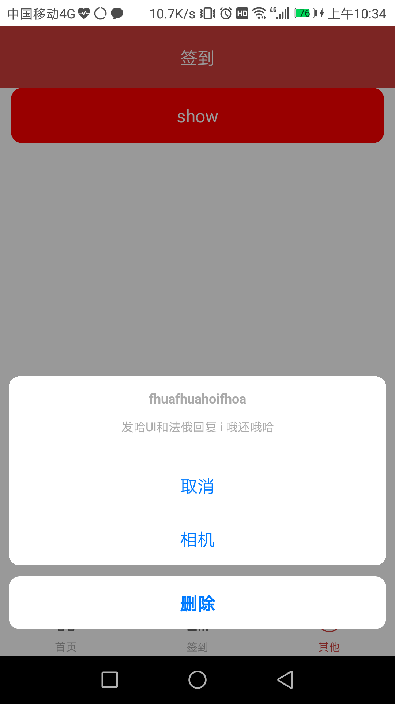
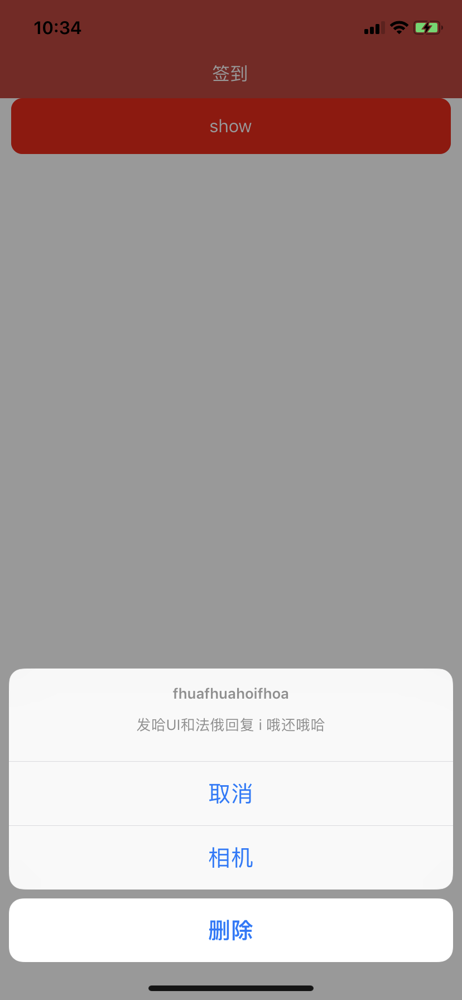

# react-native-easy-action-sheet

[](https://www.npmjs.com/package/react-native-easy-action-sheet)
[](https://www.npmjs.com/package/react-native-easy-action-sheet)
[](https://www.npmjs.com/package/react-native-easy-action-sheet)
[](https://github.com/DaiYz/react-native-easy-action-sheet/blob/master/LICENSE)

## ScreenShots
<p>


</p>

## Installation

* [npm](https://www.npmjs.com/#getting-started): `npm install react-native-easy-action-sheet --save`
* [Yarn](https://yarnpkg.com/): `yarn add react-native-easy-action-sheet`

## Example
```jsx 
import { Header } from 'react-navigation'
import { Header } from 'react-navigation-stack' (4.x)
import ActionSheet from 'react-native-easy-action-sheet'
class Demo extends React.Component {
  showActionSheet = () => {
    this.ActionSheet.show()
  }
  render() {
    return (
      <View>
        <Text onPress={this.showActionSheet}>Open ActionSheet</Text>
        <ActionSheet
          androidHeaderHeight={Header.HEIGHT}
          ref={e => this.ActionSheet = e}
          title={'Which one do you like ?'}
          options={['Apple', 'Banana', 'cancel']}
          cancelButtonIndex={2}
          destructiveButtonIndex={1}
          onPress={(index) => { /* do something */ }}
        />
      </View>
    )
  }
}

```


## Props
props | type |default | Info 
----- | ------- |  ------- | -----
 options | [string] |undefined | a list of button titles (required)
 cancelButtonIndex | number |0 | index of cancel button in options
 destructiveButtonIndex | number |undefined | index of destructive button in options
 title | string |undefined | a list of button titles (required)
 message | string |undefined | a message to show below the title
 tintColor | string |  | the color used for non-destructive button titles
 onPress | func | (index) => console.log(index) | button on press
 androidHeaderHeight | number | undefined | height of navHeader on android (required)
